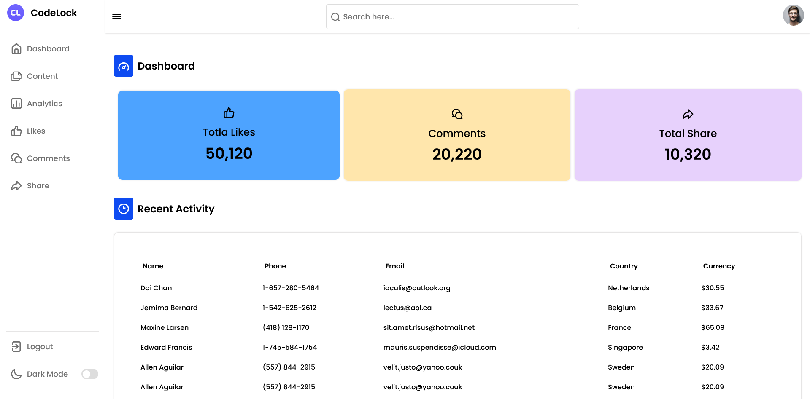
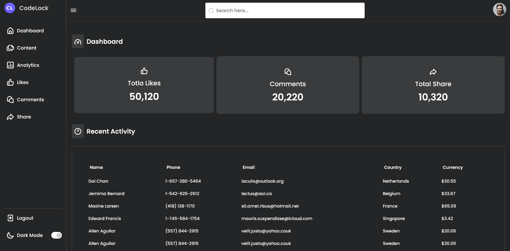

The [Responsive Admin Panel](https://farhdibehnamdev.github.io/Responsive-Admin-Panel/) is designed to practice and explore HTML and , Css, Responsive design,JavaScript.

## Table of contents

- [Overview](#overview)
  - [Screenshot](#screenshot)
  - [Links](#links)
- [My process](#my-process)
  - [Built with](#built-with)
  - [helpful resources](#helpful-resources)
- [Created a masterpiece? 🎨 Share it!](#Created-a-masterpiece)

### Screenshot

### Links

- Live Site URL: [Responsive Admin Panel](https://farhdibehnamdev.github.io/Responsive-Admin-Panel/)

### Built with

- CSS
- Semantic HTML5 markup
- Flexbox
- JavaScript

## helpful resources

#### Fonts

- [Google Fonts](https://fonts.google.com/specimen/Poppins)

#### Icons

- [Iconscout Icons](https://iconscout.com/)

#### CSS

- [Mozilla Developer Network: Beginners Guide to CSS](https://developer.mozilla.org/en-US/docs/Learn/CSS/Introduction_to_CSS)
- [Mozilla Developer Network: JavaScript Guide](https://developer.mozilla.org/en-US/docs/Web/JavaScript/Guide)

## Created a masterpiece? 🎨 Share it!

If so, please fork this repo and add a link to this README.md or create an issue with the github page link and to have it added to the README.md.
